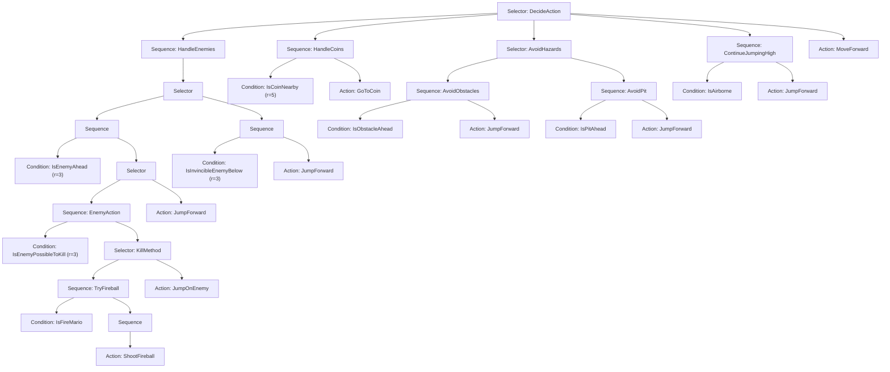

```mermaid
graph TD
    Root["Selector: DecideAction"] --> HandleEnemies["Sequence: HandleEnemies"]
    Root --> HandleCoins["Sequence: HandleCoins"]
    Root --> AvoidHazards["Selector: AvoidHazards"]
    Root --> ContinueJumpingHigh["Sequence: ContinueJumpingHigh"]
    Root --> MoveForward["Action: MoveForward"]

    %% HandleEnemies Branch
    HandleEnemies --> HE_Sel["Selector"]
    HE_Sel --> HE_Seq1["Sequence"]
    HE_Seq1 --> IsEnemyAhead["Condition: IsEnemyAhead (r=3)"]
    HE_Seq1 --> HE_Sel2["Selector"]
    
    HE_Sel2 --> EnemyAction["Sequence: EnemyAction"]
    EnemyAction --> IsEnemyKillable["Condition: IsEnemyPossibleToKill (r=3)"]
    EnemyAction --> KillMethod["Selector: KillMethod"]
    
    KillMethod --> TryFireball["Sequence: TryFireball"]
    TryFireball --> IsFireMario["Condition: IsFireMario"]
    TryFireball --> TF_Seq["Sequence"]
    TF_Seq --> ShootFireball["Action: ShootFireball"]
    
    KillMethod --> JumpOnEnemy["Action: JumpOnEnemy"]
    HE_Sel2 --> JumpForward1["Action: JumpForward"]

    HE_Sel --> HE_Seq2["Sequence"]
    HE_Seq2 --> IsInvincible["Condition: IsInvincibleEnemyBelow (r=3)"]
    HE_Seq2 --> JumpForward2["Action: JumpForward"]

    %% HandleCoins Branch
    HandleCoins --> IsCoinNearby["Condition: IsCoinNearby (r=5)"]
    HandleCoins --> GoToCoin["Action: GoToCoin"]

    %% AvoidHazards Branch
    AvoidHazards --> AvoidObstacles["Sequence: AvoidObstacles"]
    AvoidObstacles --> IsObstacleAhead["Condition: IsObstacleAhead"]
    AvoidObstacles --> JumpForward3["Action: JumpForward"]

    AvoidHazards --> AvoidPit["Sequence: AvoidPit"]
    AvoidPit --> IsPitAhead["Condition: IsPitAhead"]
    AvoidPit --> JumpForward4["Action: JumpForward"]

    %% ContinueJumpingHigh Branch
    ContinueJumpingHigh --> IsAirborne["Condition: IsAirborne"]
    ContinueJumpingHigh --> JumpForward5["Action: JumpForward"]
```
